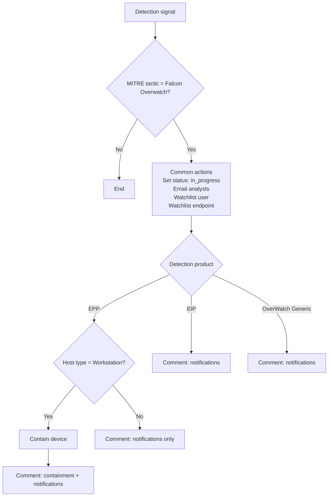

# Falcon OverWatch Detection: Notification & Remediation

A Falcon Fusion SOAR workflow that automatically triages, notifies on, and contains detections attributed to **Falcon OverWatch**, across all detection types (EPP, IDP, and OverWatch generic).

| | |
|---|---|
| **Platform** | CrowdStrike Falcon Fusion SOAR |
| **Trigger** | Signal → Detection |
| **Workflow version** | `~1` (from the trigger version constraint) |
| **Last modified** | 2026-08-12 |

---

## Overview

### Purpose

When Falcon OverWatch threat hunters flag adversary activity, response time matters. This workflow removes the manual first steps: it moves the detection into triage, alerts analysts, raises monitoring on the affected user and host, and contains the host when it is safe to do so.

### Threat Mitigated

Adversary activity that Falcon OverWatch identified or triaged, across EPP, IDP, and OverWatch generic detections.

### Outcomes

- The detection moves straight to an active triage state (`in_progress`).
- Analysts get an email notification with the detection context.
- The related **user** and **endpoint** are added to watchlists for closer monitoring.
- **EPP detections on workstations** trigger network containment to limit spread.
- A comment is added to the detection listing every action taken.

---

## Workflow Logic

### Trigger & Filter

| Setting | Value |
|---|---|
| Trigger type | `Signal` |
| Trigger name | `Detection` |
| Fires when | A detection occurs |
| Filter | `mitre_tactic` **equals** `Falcon Overwatch` |

### Branching

The workflow branches on `detection_product`. Actions within each branch run in parallel.

| Branch | Extra condition | Containment |
|---|---|---|
| EPP | `sensor_host_type` equals `Workstation` | ✅ Workstations only |
| IDP | None | ❌ |
| OverWatch Generic Detection | None | ❌ |

---

## Action Steps

### Steps 1–4: Common to All Branches

| Step | Action | Details |
|---|---|---|
| 1 | Set detection status | `in_progress` |
| 2 | Send email notification | Security analyst distribution list |
| 3 | Add user to watchlist | User referenced by the detection |
| 4 | Add endpoint to watchlist | Host referenced by the detection |

### Step 5 and Later: By Branch

| Branch | Step 5 | Step 6 |
|---|---|---|
| **EPP, Workstation** | Contain device | Add a comment recording containment, notifications, and watchlist actions |
| **EPP, Non-workstation** | Add a comment recording notifications and watchlist actions (no containment) | None |
| **IDP** | Add a comment recording notifications and watchlist actions | None |
| **OverWatch Generic** | Add a comment recording notifications and watchlist actions | None |

> **Why workstations only?** Automatically containing servers or domain controllers can cause outages, so non-workstation hosts are left for an analyst to decide.

---

## Prerequisites

### CrowdStrike Modules

- Falcon Fusion SOAR
- Falcon OverWatch
- Falcon Insight XDR (detections and visibility)
- Falcon Prevent (EPP): required for the containment branch
- Falcon Identity Protection (IDP): required if IDP detections are in scope

### Integrations

- **Email:** Fusion email action configured (SMTP, O365, or Gmail, depending on the tenant)

### Falcon Permissions

The workflow's execution context must be able to:

- Update detection status and add comments
- Add users and endpoints to watchlists
- Contain hosts (at least workstation endpoints)

### API Scopes

Typical Falcon OAuth scopes for these actions. Exact scope names depend on the action version and tenant configuration, so check them against your tenant.

| Scope | Used for |
|---|---|
| `fusion:write` | Managing and running Fusion workflows |
| `detections:write` | Setting detection status and adding comments |
| `watchlists:write` | Adding users and endpoints to watchlists |
| `hosts:write` | Host containment |
| `identity-protection:write` | IDP entity actions (if used) |

---

## Validation Checklist

Before enabling the workflow:

- [ ] The email integration is configured and allowed to send.
- [ ] Containment is allowed for the relevant workstation host groups.
- [ ] Watchlist targets (user and host) can be resolved from the detection context.
