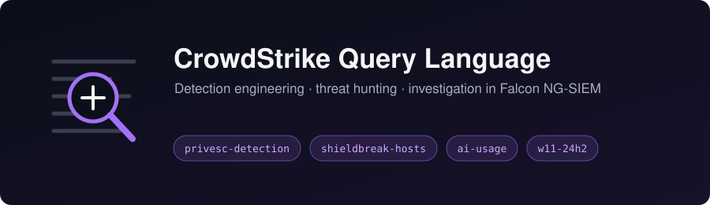

# cql-queries



A working collection of CrowdStrike Query Language (CQL) queries used for detection engineering, threat hunting, and investigation in CrowdStrike Falcon Next-Gen SIEM.

[← Back to portfolio home](../../README.md)

## Purpose

This folder exists to:

- Keep reusable queries in version control instead of scattered across saved searches
- Document the intent, data source, and tuning history behind each query
- Track detection logic as code, so changes are reviewable and reversible

## Structure

Each query lives in its own `.cql` file, named in lowercase with hyphens - for example `suspicious-powershell-encodedcommand.cql`.

## Query file format

Every query starts with a comment header so it can be understood without the surrounding context:

```
// Name:        Short descriptive title
// Purpose:     What this query detects or answers
// Data source: Event type / repository / index
// ATT&CK:      Technique ID and name, if applicable
// Severity:    Informational | Low | Medium | High
// FP notes:    Known benign patterns and how they're filtered
// Status:      Draft | Tested | Production

<query body>
```

## Usage

Queries are written against Falcon NG-SIEM and assume the event fields and repositories available in that platform. Time ranges are not hardcoded. Set them at search time unless the query depends on a specific window, in which case it's noted in the header.

Field names and data availability vary by sensor version, ingested data sources, and platform (Windows / macOS / Linux). Test before relying on any query.

## Notes

- All queries are sanitized. No hostnames, usernames, IP addresses, domains, or other environment-specific identifiers are included. Placeholder values are used where an identifier would otherwise appear.
- Queries here represent detection logic only, not configuration of or insight into any specific production environment.
- This is a personal reference repository and is not affiliated with or endorsed by CrowdStrike.
