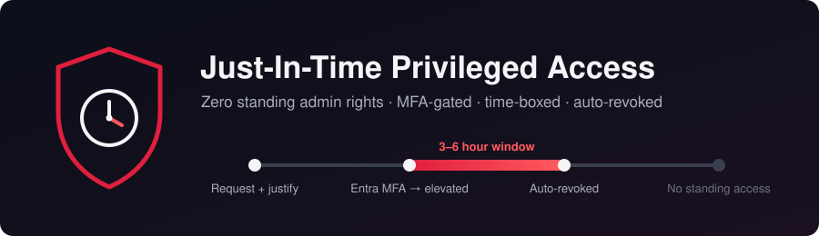
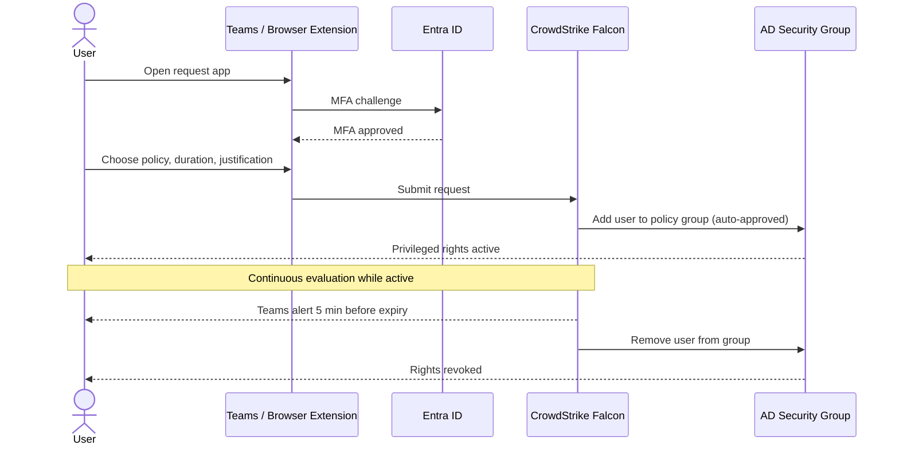

# Just-In-Time (JIT) Privileged Access Model

Replaced standing privileged access with time-boxed, MFA-protected, just-in-time elevation using CrowdStrike Falcon, Active Directory security groups, Microsoft Entra ID, and Microsoft Teams.

**Author:** Elias Tobin

[← Back to portfolio home](../../README.md)

## Situation
Identity and Access Management. Privileged access (RDP, local administrator, and domain admin rights) was granted as standing membership. Accounts held those rights 24/7 whether they were being used or not, so any compromised account with standing privileges gave an attacker immediate elevated access.

## Task
Designed and deployed a just-in-time access model so that privileged rights exist only when someone has requested them, justified them, and passed MFA, and are removed automatically when the time window ends.

## Why JIT
Just-in-time access grants a permission only when someone needs it for a specific task, and only for as long as that task takes. It is built on the principle of least privilege: if no account holds admin rights while idle, there is nothing standing for an attacker to steal and reuse. This shrinks the attack surface, limits lateral movement from a compromised account, and produces an audit trail for every privileged action.

How this deployment covers the four core parts of a JIT model ([CrowdStrike: What is JIT access?](https://www.crowdstrike.com/en-us/cybersecurity-101/identity-security/just-in-time-access/)):

| JIT component | How it's implemented here |
|---|---|
| Identity verification | Entra ID MFA on every request |
| Access request workflow | Request through Teams or the browser extension with a required justification. MFA is the approval gate, and contractors go through IT |
| Automated provisioning and deprovisioning | Falcon adds the user to the policy's AD security group and removes them when the window expires |
| Session monitoring | Continuous evaluation while access is active, plus the Falcon audit log |

## Action
- Removed all standing local administrator access across the domain (300+ endpoints) and replaced local admin password management with LAPS
- Removed standing domain admin membership across the entire domain to minimize attack paths. IT now has to request domain admin through JIT like everyone else
- Kept a single break-glass account for emergencies, in case JIT or MFA is unavailable
- Built four CrowdStrike Falcon JIT access policies, one for each type of privileged access
- Created a dedicated Active Directory security group for each policy. The group is the thing that actually grants the rights
- Scoped each policy to a specific OU so users only see the access options that apply to them
- Required Entra ID MFA with continuous evaluation on every policy
- Deployed the request app to users through the Microsoft Teams admin center
- Set up Teams notifications to warn users 5 minutes before their access is revoked
- Pushed a browser extension policy (Edge, Chrome, Firefox) so users can also request access straight from the browser
- Piloted with the IT team and a few users who needed local administrator before rolling out to everyone

## Technical Detail

### Access policies

| Policy | Audience | Elevation type | Max duration | Justification | MFA |
|---|---|---|---|---|---|
| RDP Access | IT | By request | 6 hours | Required | Entra ID, continuous evaluation |
| Local Administrator | Contractors | By request (submitted by IT on the contractor's behalf) | 3 hours | Required | Entra ID, continuous evaluation |
| Local Administrator | Approved personnel | By request | 3 hours | Required | Entra ID, continuous evaluation |
| Server Access (Domain Admin) | IT | By request | 3 hours | Required | Entra ID, continuous evaluation |

The durations are maximums. Users can request a shorter window, and every request needs a written justification.

Durations are based on risk. Local admin and domain admin carry the most risk, so they are capped at 3 hours. RDP access for IT gets 6 hours because remote support sessions tend to run longer.

### How elevation works

1. The user opens the request app in Microsoft Teams (or the browser extension).
2. The user proves their identity with Entra ID MFA.
3. The user chooses the policy they need, picks a duration, and enters a justification.
4. The request is approved automatically once MFA has passed. There is no manual approval step.
5. Falcon adds the user to the AD security group tied to that policy, and the group membership grants the privileged rights.
6. Continuous evaluation keeps checking the session while access is active.
7. Five minutes before expiry, Falcon notifies the user in Teams so they can extend or wrap up.
8. When the window ends, Falcon removes the user from the group and the rights are gone.

MFA is the approval gate. Tying approval to MFA keeps elevation fast for day-to-day admin work, while the justification, OU scoping, and time limit keep every elevation narrow and on the record.

### OU scoping
Each policy is scoped to a specific OU. A user only sees a policy in their request list if they (or the device they are on) are in the matching OU. This keeps the list short and stops users from requesting access they were never meant to have.

### Request channels
- **Microsoft Teams:** deployed through the Teams admin center. This is the main way users request access. From here they can request access, revoke their own access early, and extend their current window.
- **Browser extension:** deployed by policy to Edge, Chrome, and Firefox. The extension checks whether the user and the device are in the right OU and shows only the policies that match.

### Contractor flow
Contractors do not request access themselves. IT submits the Local Administrator request on the contractor's behalf, so a staff member is accountable for every contractor elevation.

### Known behaviour: group membership and logon sessions
Windows reads a user's group memberships when they sign in. That means:

- **New sessions (RDP to a server, a fresh logon):** access works almost instantly, because the new session picks up the new group membership.
- **The workstation the user is already signed in to:** the user has to sign out and back in before local admin rights apply on that machine.

This was found during the pilot and is now part of the user guidance.

### Reporting
Falcon keeps an audit log of every elevation: who requested it, which policy, the justification, and how long it lasted. My weekly cybersecurity report uses this log to track which policies and users have the most usage, and to review the justifications given for each elevation. This weekly review is the ongoing privilege audit: it shows who keeps needing elevated access and whether the reasons still hold up.

## Result
- Removed standing privileges from 8 accounts across 300+ endpoints: 4 with local administrator rights and 4 domain administrators, eliminating standing admin access domain-wide and cutting off the most direct attack paths to privileged access
- Replaced standing local admin with LAPS-managed local admin passwords
- Zero standing domain admin accounts outside the break-glass account. IT requests domain admin when it's needed
- 30–50 elevation requests per week, mostly from IT, each one justified, MFA-verified, time-boxed, and removed automatically
- Every elevation is logged in Falcon, and usage and justifications are reviewed in the weekly cybersecurity report
- Users request access from tools they already use (Teams and their browser), with no extra portal to learn

## Skills Demonstrated
Identity and Access Management, Privileged Access Management, Zero Standing Privileges, CrowdStrike Falcon, Active Directory security groups and OU design, Microsoft Entra ID MFA, LAPS, Microsoft Teams administration, browser policy deployment, security reporting

## Notes
- Sanitized. No real OU paths, group names, hostnames, or usernames appear in this document.
- This is a personal portfolio repository and is not affiliated with or endorsed by CrowdStrike or Microsoft.
