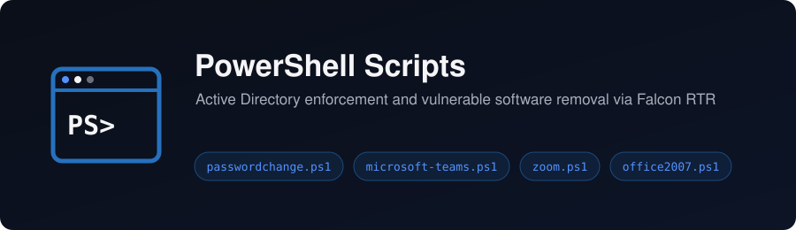

# powershell-scripts



A collection of the PowerShell scripts I've written for security operations work: identity changes in Active Directory and remediating vulnerable software across the endpoint fleet.

**Author:** Elias Tobin

[← Back to portfolio home](../../README.md)

## Contents

- [Purpose](#purpose)
- [Script Index](#script-index)
- [Structure](#structure)
- [Getting Started](#getting-started)
- [Notes](#notes)
- [Related Projects](#related-projects)

## Purpose

This folder exists to:

- Keep my PowerShell tooling in one place, next to the [Python scripts](../python-scripts)
- Document what each script does, what it needs, and how to run it safely
- Point back to the project each script was built for, where the full story lives

## Script Index

| Script | Summary | Category | Status |
|---|---|---|---|
| [passwordchange.ps1](password-change/passwordchange.ps1) | Forces a password change at next logon for every enabled user in a target OU, with exclusions by OU, username and group. Clears `PasswordNeverExpires` conflicts first, exports a timestamped audit CSV, then triggers an Entra ID delta sync. Built for the [Password Policy Overhaul](../password-policy) | Identity & Access | ✅ Completed |
| [microsoft-teams.ps1](teams-remediation/microsoft-teams.ps1) | Walks every user profile on the machine and removes per-user Microsoft Teams installs older than a fixed safe version. Built to remediate CVE-2023-4863 for the [Vulnerability Management](../vulnerability-management) project | Vulnerability Management | ✅ Completed |
| [zoom.ps1](zoom-remediation/zoom.ps1) | Removes per-user Zoom installs from every profile: the install folder, the `ZoomUMX` uninstall key in the user's registry hive, and the Start menu shortcut. Built to remediate CVE-2024-24691 for the [Vulnerability Management](../vulnerability-management) project | Vulnerability Management | ✅ Completed |
| [office2007.ps1](office2007-remediation/office2007.ps1) | Detects Microsoft Office 2007 components from the uninstall registry keys, removes them silently through `setup.exe` or `msiexec`, then verifies removal in both the registry and the filesystem. Supports `-WhatIf`, logs to `ProgramData`, and returns `0` / `3010` / `1` for clean / reboot pending / failed. Built to remediate CVE-2017-0199 for the [Vulnerability Management](../vulnerability-management) project | Vulnerability Management | ✅ Completed |

**Categories:** Identity & Access · Vulnerability Management · Automation · Incident Response · Utilities

## Structure

Each script lives in its own subfolder, named for the job it does:

```
powershell-scripts/
├── README.md
├── password-change/
│   └── passwordchange.ps1
├── teams-remediation/
│   └── microsoft-teams.ps1
├── zoom-remediation/
│   └── zoom.ps1
└── office2007-remediation/
    └── office2007.ps1
```

The same scripts also live in the project folders they were written for, so each project stays self-contained.

## Getting Started

**Prerequisites:** Windows PowerShell 5.1+, run as administrator (or SYSTEM)

- **passwordchange.ps1** needs the `ActiveDirectory` module (RSAT) and rights to modify user objects in the target OU. The final `Start-ADSyncSyncCycle` call needs to run on the Entra Connect server. Set `$TargetOU` and the exclusion lists at the top of the script before running.
- **The remediation scripts** were deployed at scale through CrowdStrike Falcon Real-Time Response (RTR), and run the same way locally from an elevated prompt. They need no modules.

```powershell
# Preview what office2007.ps1 would remove without changing anything
.\office2007.ps1 -WhatIf

# Run it for real
.\office2007.ps1
```

`office2007.ps1` is the only script with a `-WhatIf` mode. The others act as soon as they run, so test them on a lab machine first.

## Notes

- All scripts are sanitized. No hostnames, usernames, domains or other environment-specific identifiers are included. Placeholder values such as `contoso.com` are used where an identifier would otherwise appear.
- Every script here changes systems: it deletes software or modifies user accounts. Review and adapt them to your own environment before running them.
- These scripts are provided as-is for reference.

## Related Projects

- [Critical Vulnerability Management](../vulnerability-management): the CVEs the remediation scripts closed, and how they were rolled out through RTR
- [Domain-Wide Password Policy Overhaul](../password-policy): the policy change `passwordchange.ps1` enforced
- [Python Scripts](../python-scripts): the Python side of my security tooling
- [JIT Access Model](../jit-access-model): the other half of the identity work
- [CrowdStrike Query Language (CQL)](../cql-queries): finding the vulnerable hosts in the first place
