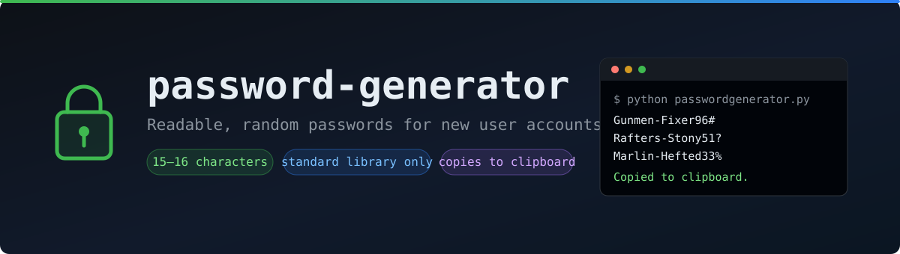

# password-generator

A small Python script that builds readable 15-16 character passwords for new user accounts, then copies the result to the clipboard. Two dictionary words, a number, and a symbol: strong enough to hand out, short enough to fit password field limits, and easy to read aloud over the phone.

**Author:** Elias Tobin

[← Back to python-scripts](../README.md) · [← Back to portfolio home](../../../README.md)

## Contents

- [Purpose](#purpose)
- [How It Works](#how-it-works)
- [Usage](#usage)
- [Requirements](#requirements)
- [Files](#files)
- [Password Strength](#password-strength)
- [Notes](#notes)
- [Related Projects](#related-projects)

## Purpose

Onboarding a new user means handing them a first password. Typing keyboard mash like `xK7#qp2Lm!vZ9` over the phone wastes time and invites typos, and picking passwords by hand produces predictable ones.

This script exists to:

- Produce first-login passwords that meet a 15-character minimum without going over common field limits
- Keep them readable, so they can be dictated, typed, and confirmed quickly
- Take the choice away from a human, so there is no `Winter2025!` pattern across accounts
- Drop the password straight onto the clipboard, ready to paste into the account creation form

## How It Works

Every password follows the same shape:

```
Marlin-Hefted33%
└──┬─┘ └──┬──┘└┬┘
   │      │    └── 2-digit number + symbol
   │      └─────── second word
   └────────────── first word
```

The script works backwards from the target length:

1. Picks a target of 15 or 16 characters at random.
2. Subtracts the 4 fixed characters (one hyphen, two digits, one symbol), leaving the budget for the two words.
3. Picks a length for the first word, then pulls the second word from the group whose length fills the rest of the budget exactly.
4. Adds a 2-digit number and a symbol on the end, so the password satisfies complexity rules that require both.

Words are sorted into groups by length when `words.txt` loads, so step 3 is a direct lookup rather than a guess-and-retry loop.

All random choices use Python's `secrets` module, not `random`. `secrets` is backed by the operating system's cryptographic random source; `random` is a predictable pseudo-random generator and is not suitable for anything that protects an account.

## Usage

```bash
python passwordgenerator.py
```

```
How many passwords do you need? 3
Gunmen-Fixer96#
Rafters-Stony51?
Marlin-Hefted33%

Copied the last one to the clipboard.
```

Ask for one password at a time when the clipboard matters. Only one value can sit in the clipboard, so on a batch the script copies the last password and says so.

Run it from any folder. The script locates `words.txt` relative to its own path, not the working directory.

## Requirements

**Python 3.10+, standard library only.** No `pip install` step.

Clipboard support per platform:

| Platform | Clipboard tool | Included with OS? |
|---|---|---|
| Windows | `clip` | ✅ Yes, works out of the box |
| macOS | `pbcopy` | ✅ Yes, works out of the box |
| Linux (X11) | `xclip` | ❌ `sudo apt install xclip` |
| Linux (Wayland) | `wl-copy` | ❌ `sudo apt install wl-clipboard` |

If no clipboard tool is available, the script still prints the passwords and notes that the copy did not happen. Generation never depends on the clipboard.

## Files

| File | Purpose |
|---|---|
| [passwordgenerator.py](passwordgenerator.py) | The script |
| [words.txt](words.txt) | 34,912 words, 4-8 letters, plain a-z, proper nouns removed |
| [requirements.txt](requirements.txt) | Dependency notes (no packages required) |
| [banner.svg](banner.svg) | README banner |

`words.txt` has to stay in the same folder as the script. To change the vocabulary, edit the file: one word per line, letters only. The script regroups by length on the next run, and any word length that cannot be paired to hit 15-16 characters is simply never selected.

## Password Strength

These passwords carry roughly **35 bits of entropy**. Read that as: no realistic chance of being guessed against a login prompt that rate-limits or locks out, but not built to survive offline cracking if a password hash is stolen.

That is a deliberate trade. Readability at 15-16 characters costs entropy — a 4-word version of this script reached ~61 bits, but produced passwords around 30 characters. For temporary credentials that users replace at first login, 35 bits is the right side of the trade.

**Use these for first-login passwords that get changed.** For credentials that persist, especially service accounts, generate longer random strings and store them in a password manager.

## Notes

- Nothing is written to disk and nothing is logged. Passwords exist in the console output and the clipboard only.
- Clear the clipboard after pasting. Clipboard contents persist and are readable by other applications on the machine.
- `words.txt` is generated from a standard system dictionary. It contains no environment-specific data.
- Proper nouns are filtered out, so passwords read as ordinary words rather than surnames and place names.

## Related Projects

- [Domain-Wide Password Policy Overhaul](../../password-policy): the 15-character minimum this script is built to satisfy
- [JIT Access Model](../../jit-access-model): just-in-time access, the other half of account provisioning
- [python-scripts](../README.md): the rest of the Python tooling in this repo
